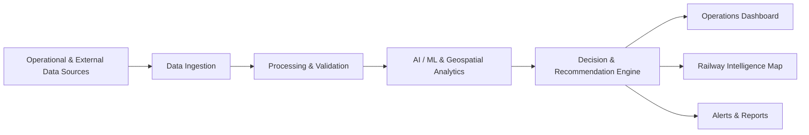
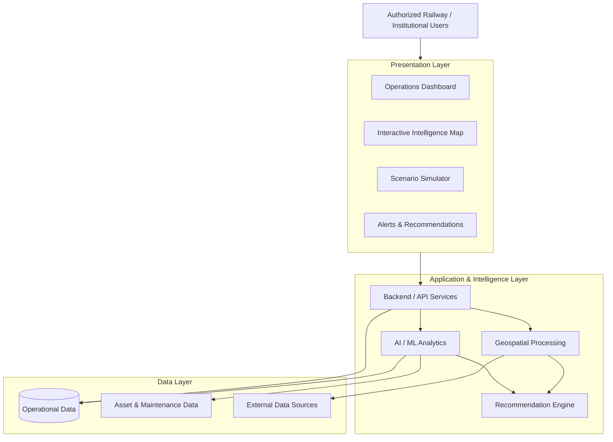

# RailSutra

> **Intelligent Railway Operations, Predictive Analytics & Decision Support**

RailSutra is an AI-powered railway operations intelligence and decision-support platform for railway organizations and institutional B2B users. It combines operational analytics, predictive intelligence, geospatial analysis, and scenario simulation to support better planning and network-level decision-making.

> **Repository status:** Technology stack, repository structure, implementation status, and runtime commands could not be verified because the repository itself was not provided with this request. Unverified items are intentionally marked as planned, optional, or unavailable rather than being presented as implemented.

---

## Overview

Railway operations involve interconnected decisions across passenger demand, capacity, network congestion, asset health, weather, and service disruptions.

RailSutra is designed to provide a unified intelligence layer for these operational challenges.

The platform focuses on:

- Forecasting passenger demand and seasonal surges
- Identifying capacity gaps and network bottlenecks
- Monitoring operational and infrastructure risk
- Supporting predictive and regional maintenance planning
- Visualizing railway infrastructure and operational conditions
- Simulating operational scenarios before decisions are made
- Delivering alerts and recommendations to authorized decision-makers

RailSutra is intended as a **decision-support platform**, not an autonomous railway control system.

---

## Core Capabilities

| Module | Purpose | Operational Outcome |
|---|---|---|
| **Festive Demand & Capacity Optimization** | Forecast passenger demand and identify capacity gaps around seasonal and festival periods | Better special-train and capacity planning |
| **Track Bottleneck & Heatmap Analytics** | Analyze utilization, congestion, bottlenecks, and delay propagation | Improved network planning and dispatch decisions |
| **Predictive & Regional Maintenance** | Combine asset history, service records, operational age, and environmental conditions | Earlier identification of maintenance risk |
| **Operations Command Center** | Centralize network KPIs, alerts, delays, capacity, and risk indicators | Faster operational awareness |
| **Interactive Railway Intelligence Map** | Visualize railway infrastructure, demand, congestion, maintenance risk, weather, and terrain | Geospatial operational intelligence |
| **Predictive Scenario Simulator** | Model changes to trains, frequencies, dispatch, speed, routing, demand, weather, and maintenance conditions | Evaluate operational scenarios before action |
| **Smart Alerts & Decision Support** | Surface demand, capacity, congestion, maintenance, and weather risks | Actionable operational recommendations |

---

## How RailSutra Works

The conceptual intelligence flow is:



The exact implementation of each layer depends on the repository's configured services and dependencies.

---

## Architecture

The intended platform architecture separates user-facing operations from analytical and intelligence workloads.



> **Implementation note:** The concrete framework, database, service boundaries, and infrastructure cannot be verified from the supplied repository information.

---

## Technology Stack

The following technologies are part of the proposed/considered platform scope. They should only be marked as implemented after they are present in the repository configuration.

| Layer | Technology | Status |
|---|---|---|
| Frontend | Repository-specific framework | **Not verified** |
| Backend | Repository-specific framework | **Not verified** |
| Database | Repository-specific database | **Not verified** |
| AI/ML | Repository-specific implementation | **Not verified** |
| Maps | MapLibre / MapTiler | **Planned / Optional** |
| Geospatial | Turf.js | **Planned / Optional** |
| Weather | OpenWeather | **Planned / Optional** |
| Terrain | OpenTopography | **Planned / Optional** |
| Railway / Train Data | RailRadar | **Planned / Optional** |
| Infrastructure Data | Overpass API / OpenStreetMap | **Planned / Optional** |
| Deployment | Repository-specific configuration | **Not verified** |

---

## Repository Structure

The actual repository structure was not available for inspection when this README was generated.

Do not assume the following directories exist. Once the repository structure is available, this section should be replaced with the verified tree.

```text
RailSutra/
├── README.md
├── docs/
├── ...
└── ...
```

Only directories and files that actually exist should be documented here.

---

## Getting Started

### Prerequisites

The repository's required runtime, package manager, database, and supporting services could not be verified.

Use the project's existing configuration files to determine the required prerequisites.

Typical configuration files to inspect include:

- `package.json`
- `requirements.txt`
- `pyproject.toml`
- `go.mod`
- `pom.xml`
- `Dockerfile`
- `docker-compose.yml`
- `.env.example`
- CI/CD configuration

### Installation

Installation commands must be taken from the repository's actual package configuration.

```bash
# Use the repository's documented installation command.
```

### Environment Variables

If the repository contains an `.env.example` file, copy it to the appropriate local environment file and populate only the required values.

```bash
cp .env.example .env
```

Do not commit API keys, credentials, tokens, private certificates, or other secrets.

### Running Locally

The exact frontend, backend, ML-service, and supporting-service commands could not be verified without the repository configuration.

Use the commands defined by the project's package scripts, service configuration, or development documentation.

---

## External Data Sources & APIs

RailSutra is designed to support several external data and geospatial services.

| Source | Intended Purpose | Status |
|---|---|---|
| **RailRadar** | Railway/train-related data | Planned / Optional |
| **MapTiler** | Map tiles and geospatial visualization | Planned / Optional |
| **MapLibre** | Interactive map rendering | Planned / Optional |
| **OpenWeather** | Weather and environmental conditions | Planned / Optional |
| **OpenTopography** | Terrain and elevation information | Planned / Optional |
| **Turf.js** | Client/server-side geospatial processing | Planned / Optional |
| **Overpass API / OpenStreetMap** | Railway infrastructure and geographic data | Planned / Optional |

These integrations must not be interpreted as active production integrations until corresponding configuration and implementation exist in the repository.

---

## AI & Intelligence Layer

RailSutra's intelligence layer is designed around operational decision support rather than autonomous control.

### Demand Forecasting

Analyze historical and seasonal passenger patterns to identify expected demand changes and potential capacity gaps.

Potential outputs include:

- Demand forecasts
- Festival and seasonal surge indicators
- Capacity-gap indicators
- Special-train recommendations
- Overcrowding risk
- Underutilization risk

### Congestion & Bottleneck Analysis

Analyze network utilization and operational conditions to identify:

- Track bottlenecks
- Station and junction congestion
- High-utilization sections
- Potential delay propagation
- Dispatch and sequencing opportunities
- Rerouting opportunities

### Predictive Maintenance

The intended maintenance intelligence layer can incorporate:

- Asset history
- Maintenance records
- Overhaul records
- Operational age and hours
- Component-level service records
- Environmental and climate conditions

Potential outputs include:

- Failure-risk indicators
- Asset health scores
- Regional maintenance priorities
- Climate-aware maintenance recommendations

### Risk Scoring

Operational data can be transformed into risk indicators covering areas such as:

- Passenger demand
- Capacity
- Congestion
- Asset health
- Weather
- Operational disruption

Risk scores should be treated as analytical indicators and validated by authorized personnel.

### Scenario Simulation

The platform is intended to support what-if analysis involving:

- Adding or removing trains
- Changing train frequencies
- Modifying dispatch strategies
- Changing speeds
- Rerouting services
- Passenger demand surges
- Weather disruptions
- Maintenance disruptions

Simulation outputs are intended to support planning and comparison rather than directly control railway operations.

### Recommendation Engine

The recommendation layer is intended to combine analytical outputs into operationally relevant suggestions.

Recommendations may include:

- Capacity adjustments
- Special-train requirements
- Dispatch changes
- Sequencing alternatives
- Rerouting considerations
- Maintenance priorities
- Risk mitigation actions

---

## Operations Command Center

The Operations Command Center is intended to provide a centralized view of network conditions.

Potential operational indicators include:

- Network KPIs
- Capacity utilization
- Delay status
- Operational alerts
- Risk overview
- Demand conditions
- Congestion conditions
- Maintenance risks

Only indicators supported by implemented backend data sources should be exposed as live production metrics.

---

## Interactive Railway Intelligence Map

The map interface is intended to provide a geospatial view of railway operations.

Potential layers include:

- Indian railway network
- Train locations or services
- Tracks
- Stations
- Demand heatmaps
- Congestion heatmaps
- Maintenance-risk regions
- Weather conditions
- Terrain and elevation

Layer availability depends on the configured data sources and implementation.

---

## Smart Alerts

RailSutra is designed to surface operational signals through categorized alerts.

| Alert Type | Intended Signal |
|---|---|
| Demand | Significant change or surge in expected passenger demand |
| Capacity | Potential mismatch between demand and available capacity |
| Congestion | Elevated utilization or network bottleneck |
| Maintenance | Elevated asset or component risk |
| Weather | Environmental conditions affecting operations |
| Predictive | Model-generated operational risk or recommendation |

Alerts should provide sufficient context for an authorized operator to validate the underlying condition before taking action.

---

## Security & Data Handling

Security capabilities should reflect the actual repository implementation.

| Capability | Status |
|---|---|
| Authentication | Not verified |
| Authorization / RBAC | Not verified |
| Secret Management | Not verified |
| API Security | Not verified |
| Logging | Not verified |
| Auditability | Not verified |
| Data Privacy Controls | Not verified |

### Security Principles

Regardless of implementation status:

- Never commit secrets to source control.
- Keep credentials outside application source code.
- Validate external input at service boundaries.
- Restrict privileged operations to authorized users.
- Treat operational recommendations as sensitive decision-support outputs.
- Maintain appropriate audit trails where required by the deployment environment.

Implemented controls should be documented separately once verified.

---

## Development

Development practices should follow the repository's actual tooling and configuration.

### Code Organization

Keep application, analytical, data-processing, infrastructure, and documentation concerns separated according to the project's existing structure.

### Testing

Use the repository's configured test framework and test commands.

Do not represent unconfigured testing infrastructure as implemented.

### Linting & Formatting

Use the project's existing formatter and linter configuration where present.

### Development Commands

Document only commands that are defined by the repository.

Examples should not be treated as executable instructions until verified against the project's configuration.

---

## Roadmap

### Completed

No repository implementation details were available to verify completed capabilities.

Features should be moved into this section only after they are demonstrably implemented in the repository.

### In Progress

No implementation status was available to verify features currently under development.

### Planned

The broader product direction includes:

- Festive demand forecasting
- Capacity-gap analysis
- Railway network bottleneck analytics
- Predictive maintenance intelligence
- Interactive railway geospatial visualization
- Scenario simulation
- Smart operational alerts
- Weather and terrain intelligence
- Decision-support recommendations
- Additional railway and institutional data integrations

These items represent product scope and should not be interpreted as completed functionality.

---

## Documentation

Detailed technical documentation should live outside this README.

Recommended documentation areas include:

```text
docs/
├── architecture.md
├── development.md
├── api.md
├── ml.md
├── geospatial.md
└── deployment.md
```

The files above should only be linked from this README after they have actually been created.

---

## Contributing

Contributions should follow the repository's established development workflow.

A typical contribution flow is:

1. Create a focused branch for the change.
2. Implement the change with appropriate tests.
3. Run the repository's configured validation, linting, and formatting checks.
4. Update relevant documentation.
5. Open a pull request describing the change and its operational impact.
6. Address review feedback before merging.

Repository-specific contribution requirements should take precedence once a `CONTRIBUTING.md` or equivalent policy exists.

---

## License

> **License has not yet been selected.**

No open-source license should be assumed until one is explicitly added to the repository.

---

## Disclaimer

RailSutra is a **decision-support and analytical platform**.

Its forecasts, risk indicators, simulations, alerts, and recommendations are intended to support operational planning and decision-making. They should be **validated by authorized railway personnel before operational use**.

RailSutra should not be treated as an autonomous railway control system, and analytical outputs should not independently trigger operational actions without appropriate human validation and organizational controls.

---

## Project Status

RailSutra's product scope includes railway operations intelligence, predictive analytics, geospatial analysis, maintenance intelligence, scenario simulation, and decision support.

Implementation status should always be determined from the repository rather than from this product description.

**Repository truth comes first.**
